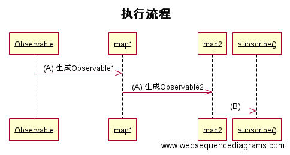

### RxJava 对于"变换"的理解（RxJava真正的核心）

> RxJava中常用的"变换"

  RxJava中的所有的操作 ```map```、```flatMap```、```groupBy```、```scan```、```concat```等等 (这些操作方法的具体使用请看另一篇文章) 都是一种"变换"。为了更好地实现复杂的链式操作，我们就需要来好好解析下它的工作原理了。

> RxJava"变换"的原理

  这是```map()```的源码(源码版本为RxJava1.1.6)，其中调用了"变换"的核心方法```left()```，我们先来分析下这段代码：   


```java
//Observable.java
public final <R> Observable<R> map(Func1<? super T， ? extends R> func) {
    return lift(new OperatorMap<T， R>(func));
}

public final <R> Observable<R> lift(final Operator<? extends R， ? super T> operator) {
   return new Observable<R>(new OnSubscribeLift<T， R>(onSubscribe， operator));
}

//OnSubscribeLift.java
@Override
public void call(Subscriber<? super R> o) {
    try {
        Subscriber<? super T> st = hook.onLift(operator).call(o);
        try {
            // new Subscriber created and being subscribed with so 'onStart' it
            st.onStart();
            parent.call(st);
        } catch (Throwable e) {
            // localized capture of errors rather than it skipping all operators
            // and ending up in the try/catch of the subscribe method which then
            // prevents onErrorResumeNext and other similar approaches to error handling
            Exceptions.throwIfFatal(e);
            st.onError(e);
        }
    } catch (Throwable e) {
        Exceptions.throwIfFatal(e);
        // if the lift function failed all we can do is pass the error to the final Subscriber
        // as we don't have the operator available to us
        o.onError(e);
    }
}
```

通过上面的源码我们可以得知"变换"```left()```的流程如下（有些代码没有列出，此处不再赘述，感兴趣的朋友可以去Github上详细看下）：
通过```hook.onLift(operator)```执行封装的操作，通过```call()```传入原始```Subscriber```然后封装成新的```Subscriber```，然后通知父```Observable```来处理这个新的```Subscriber```。

 简述:
 1. 创建一个新的```Observable```（被观察者）
    - 新的```Observable```的```call()```中
      a. 通过```Operator```来创建一个新的```Subscriber```（观察者）。
      b. 调用父```Observable```的```call```方法通知它对新创建的```Subscriber```进行处理。


我们通过下面的一个例子来理解下整个链式操作的流程：

```java
Observable.just("hello"， "my"， "name"， "is"， "nichool")
        .map(new Func1<String， String>() {
            @Override
            public String call(String s) {
                return "map: " + s;
            }
        })
        .map(new Func1<String， String>() {
            @Override
            public String call(String s) {
                return "map1: " + s;
            }
        })
        .subscribe(new Action1<String>() {
            @Override
            public void call(String s) {
                LogUtils.LogW(s);
            }
        });
```
**先预想下将会打印的Log是什么！！**.

我们来一步一步分析，上面的代码可以分成下面这几个流程：



执行流程时序图中(A)操作: 也就是刚才的```left()```的简述

时序图(B)操作：```Observable2.subscribe()```将注册的```Subscriber```传入并调用```call()```，开始通知流程


 通知流程时序图中操作：
  (C) : 调用Observable2.call() - ( 就是```left()```中```call```方法）生成新的Subscriber subscriber2 然后调用Observable1.call();
  (D) : 调用Observable1.call() - 生成 subscriber1，调用 Observable.call();
  (E) : 调用Observable.call() - 将封装了所有操作的subscriber1传入call方法中，开始发送流程


 发送流程时序图中操作：
  (F) : 调用subscriber1 中的onNext 等方法
  (I) : 调用subscriber2 中的onNext 等方法
  (J) : 调用subscriber(此处为上面代码中的subscribe()方法中的Subscriber) 中的onNext 等方法

 整个流程合起来的流程图 [下图来源](https://gank.io/post/560e15be2dca930e00da1083#toc_15)


这是结果的Log

```java
RxJavaDemo: map1: map: hello
RxJavaDemo: map1: map: my
RxJavaDemo: map1: map: name
RxJavaDemo: map1: map: is
RxJavaDemo: map1: map: nichool
```

> 总结

RxJava中"变换"的核心就是将**操作**封装成新的观察者，多个”变换“的链式操作也就是多个观察者与被观察者相互通知与处理的流程，整个RxJava项目通过这种代理的思想来实现复杂的逻辑。(_真心厉害！！！_)

**本文的分析将非常有助于线程调度方面的理解！！**
